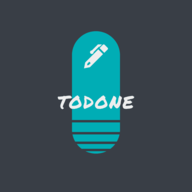

<h1 align="center">Welcome to Todone 👋</h1>
<p>
  
  <a href="https://github.com/hayat-tamboli/todo-app/blob/master/LICENSE" target="_blank">
    
  </a>
  <a href="https://twitter.com/HayatTamboli" target="_blank">
    
  </a>
</p>
<p align="center">

  </p>

> A very minimalistic designed todo app which is actually a website but, it can work as an app(PWA)

### 🏠 [Homepage](https://todone-minimal.vercel.app/)

## Install

```sh
npm install
```

## Usage

```sh
npm run serve
```

## Linting

```sh
npm run lint
```

## Author

👤 **Hayat Tamboli**

* Website: https://hayattamboli.vercel.app
* Twitter: [@HayatTamboli](https://twitter.com/HayatTamboli)
* Github: [@hayat-tamboli](https://github.com/hayat-tamboli)
* LinkedIn: [@hayat-tamboli](https://linkedin.com/in/hayat-tamboli)

## 🤝 Contributing

Contributions, issues and feature requests are welcome!<br />Feel free to check [issues page](https://github.com/hayat-tamboli/todo-app/issues). 

## Show your support

Give a ⭐️ if this project helped you!

## 📝 License

Copyright © 2020 [Hayat Tamboli](https://github.com/hayat-tamboli).<br />
This project is [MIT](https://github.com/hayat-tamboli/todo-app/blob/master/LICENSE) licensed.
